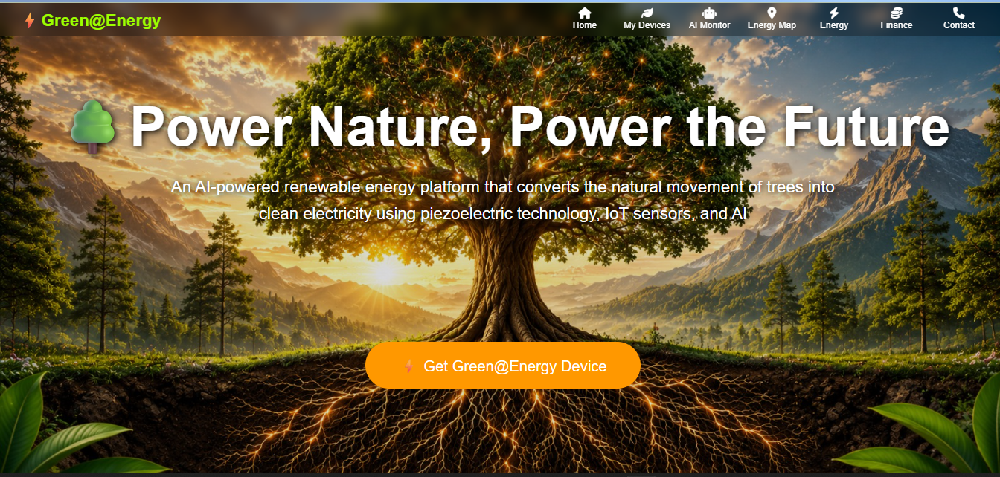
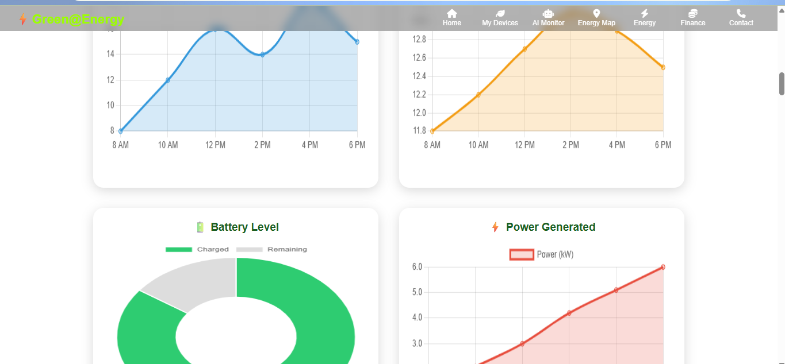
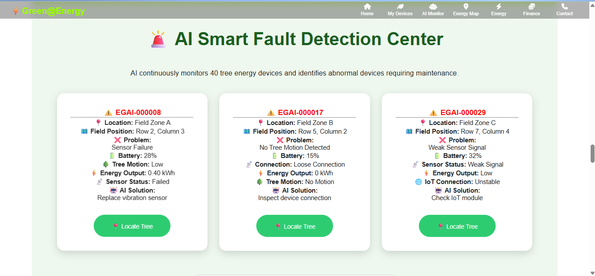
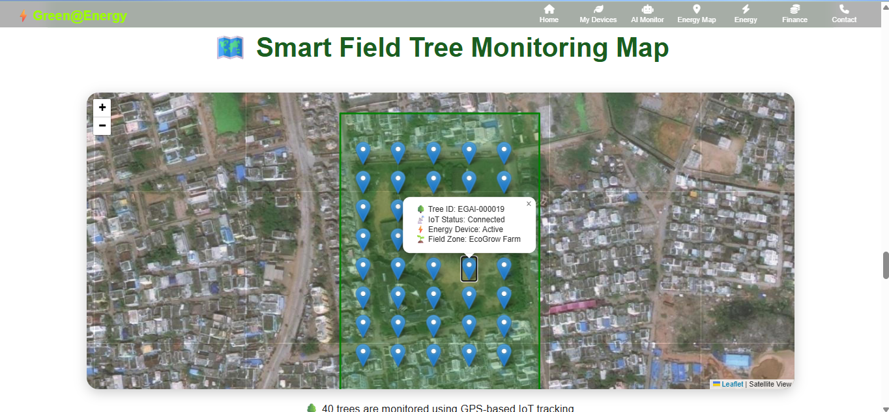

🌱 Green@Energy – Smart Tree Monitoring & Sustainable Energy Harvesting

1) Project Overview

Green@Energy is a smart environmental monitoring and sustainable energy harvesting concept that combines trees, piezoelectric energy harvesting, IoT sensors, and AI-based monitoring.

The system aims to monitor tree health and environmental conditions while exploring the possibility of generating small amounts of renewable electrical energy from tree branch movement.

2) Problem Statement

Trees are important for environmental sustainability, but conventional monitoring methods require regular manual observation.

At the same time, natural movement such as wind-induced branch vibration is an available source of mechanical energy that can be explored for small-scale energy harvesting.

3) Proposed Solution

Green@Energy combines:

- 🌳 Smart tree monitoring
- 🌬️ Wind and branch movement
- ⚡ Piezoelectric energy harvesting
- 🔌 Rectifier circuit
- 🔋 Battery storage
- 📡 IoT sensors
- 🤖 AI-based monitoring
4) Working Process

Wind Movement  
↓  
Tree Branch Vibration  
↓  
Piezoelectric Material  
↓  
Electrical Energy Generation  
↓  
Rectifier Circuit  
↓  
Battery Storage  
↓  
Low-Power Applications

5) Energy Harvesting

Piezoelectric materials can convert mechanical vibration into electrical energy.

When tree branches move due to wind, the vibration can be transferred to a piezoelectric material. The generated electrical output can then be rectified and stored for suitable low-power applications.

6) AI-Based Tree Monitoring

The project concept also includes AI-based monitoring to analyze tree and environmental conditions.

Possible monitoring parameters include:

- Tree health
- Environmental conditions
- Sensor status
- Wind movement
- Energy generation
- Device health

7) IoT Monitoring

IoT sensors can collect environmental and device information and make the data available through a monitoring dashboard.

 Technologies Used

- HTML
- CSS
- JavaScript
- IoT concepts
- AI/ML concepts
- Piezoelectric energy harvesting
- Data visualization
- Environmental monitoring

9)Project Files

- `index.html` – Main website
- `style.css` – Website styling
- `script.js` – Interactive functionality
- `*.jpeg` – Project images
- `*.mp4` – Project demonstration videos

10)Future Improvements

- Real-time IoT sensor integration
- Real hardware-based energy measurement
- Cloud-based data storage
- Machine-learning-based tree health prediction
- Mobile monitoring application
- Improved energy storage and management

👨‍💻 Developer

**Hemanth Jaya Raghava Mandapati**

BCA – Data Science

Aditya Degree College, Kakinada, Andhra Pradesh

---> Live Demo<---

**Live Website:**  
https://hemanthjayaraghava-mandapati.github.io/Green-Energy/

## 📸 Project Screenshots

### 🌱 Green@Energy Homepage

### 📊 Energy Dashboard & Graphs

### 🚨 AI Smart Fault Detection

### 🗺️ Smart Field Tree Monitoring Map

